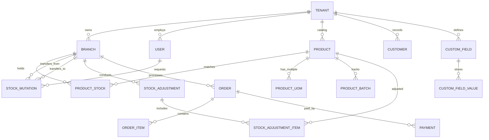

# POS Solution Overview - STECCA POS

Dokumen ini merupakan blueprint arsitektur sistem dan spesifikasi teknis untuk pengembangan produk **SaaS POS Multi-Industri (STECCA POS)**. Rancangan ini dirancang untuk mendukung skalabilitas horizontal mulai dari usaha mikro (UMKM) hingga skala perusahaan ritel multi-cabang (Enterprise) dengan pendekatan *metadata-driven template configuration*.

---

## 1. Executive Summary

Sistem **STECCA POS** adalah platform Point of Sale multi-tenant, multi-branch, dan multi-industry yang dibangun dengan pendekatan modular. Masalah utama dari kebanyakan POS tradisional adalah ketergantungan pada kode khusus industri (*hardcoded logic*), yang mempersulit pengembangan fitur baru dan pemeliharaan jangka panjang.

STECCA POS mengatasi tantangan ini dengan memisahkan **Engine Transaksi Inti** (seperti pemrosesan pembayaran, pembukuan persediaan, perpajakan, dan otorisasi pengguna) dari **Logika Presentasi dan Alur Kerja Bisnis** yang dikendalikan oleh konfigurasi JSON (*JSON-schema configuration*). Pengguna dapat memilih tipe usaha mereka saat registrasi pertama kali (*onboarding*), dan sistem akan secara dinamis memuat modul, skema validasi database, antarmuka kasir (POS UI), serta aturan otomatisasi yang relevan tanpa memerlukan modifikasi pada basis kode utama.

---

## 2. Business Type & Template Comparison

Sistem mendukung lebih dari 20 jenis industri melalui mekanisme template siap pakai. Sebagai perbandingan taktis untuk memperjelas fleksibilitas rancangan ini, berikut adalah rincian **5 template bisnis paling relevan** beserta matriks perbandingannya:

### Matriks Perbandingan 5 Template Bisnis Utama

| Fitur / Karakteristik | 1. Retail & Minimarket | 2. Restoran & Cafe (F&B) | 3. Barbershop & Salon | 4. Bengkel & Service | 5. Rental & Sewa |
| :--- | :--- | :--- | :--- | :--- | :--- |
| **Model Inventaris** | Produk fisik dengan SKU/Barcode, serial number opsional. | Bahan baku (*ingredients*), resep (*BOM*), dan produk jadi. | Jasa/Layanan (non-fisik) & produk ritel perawatan. | Suku cadang (*spareparts*) & jasa mekanik/tenaga kerja. | Aset fisik yang dapat disewakan kembali (inventaris terbatas). |
| **Pemicu Transaksi** | Scan barcode langsung pada kasir (*speed checkout*). | Pemesanan meja (*table management*), pengiriman ke dapur. | Reservasi/Booking slot waktu, penunjukan staf/stylist. | Pembuatan Surat Perintah Kerja (SPK) / Work Order. | Pemeriksaan kondisi barang (Out/In) & jaminan (*deposit*). |
| **Struktur Harga** | Harga tetap, grosir bertingkat, promosi terikat waktu. | Harga menu, biaya tambahan (*service charge*), addon/modifier. | Harga layanan tetap, komisi staf, paket sesi *treatment*. | Harga sparepart + tarif jasa per jam atau tarif tetap. | Tarif durasi (per jam/hari), denda keterlambatan. |
| **Penjadwalan & Sumber Daya** | Tidak membutuhkan penjadwalan sumber daya internal. | Manajemen antrean meja & alokasi kapasitas dapur. | Kalender jadwal staf, ketersediaan bilik/kursi. | Jadwal mekanik, alokasi stall/pos pengerjaan kendaraan. | Manajemen kalender ketersediaan aset sewa. |
| **Mode Offline** | Sangat Kritis (kasir harus terus berjalan meski internet mati). | Kritis Menengah (sinkronisasi meja & dapur lokal via LAN). | Rendah (pemesanan online dominan secara real-time). | Rendah (fokus pada pelacakan status pekerjaan). | Rendah (fokus pada kontrol dokumen & kondisi fisik). |

---

## 3. Template Configuration

Semua logika khusus industri dikontrol melalui struktur konfigurasi JSON. Ketika sebuah bisnis didaftarkan atau diubah tipenya, sistem memuat konfigurasi ini ke memori cache POS (Redis/LocalState) untuk mengatur perilaku UI dan validasi API.

### Skema Konfigurasi JSON Template (`business_template_config.json`)

```json
{
  "template_id": "temp_restaurant_fb_01",
  "business_type": "Restoran & Cafe",
  "ui_layout": {
    "pos_interface": "grid_table_view",
    "enable_kitchen_display": true,
    "enable_customer_ordering_qr": true,
    "theme_color_primary": "#E28743"
  },
  "modules_active": {
    "inventory_recipe_bom": true,
    "table_management": true,
    "booking_engine": false,
    "service_order_spk": false,
    "asset_deposit_tracking": false,
    "commission_engine": true
  },
  "database_validations": {
    "allow_negative_stock": false,
    "require_customer_id": false,
    "require_resource_assignment": false
  },
  "transaction_rules": {
    "default_tax_rate": 0.11,
    "service_charge_rate": 0.05,
    "payment_timing": "post_service",
    "invoice_auto_split_allowed": true
  },
  "custom_entity_mappings": {
    "Order": {
      "table_number": "integer",
      "pax_count": "integer",
      "waiter_id": "uuid"
    },
    "Product": {
      "is_spicy_level_allowed": "boolean",
      "modifiers_group_id": "uuid"
    }
  }
}
```

---

## 4. Core Modules

Engine inti STECCA POS mencakup 20 modul dasar yang selalu tersedia dan terekspos melalui API standar. Modul-modul ini bersifat agnostik terhadap industri dan dikonfigurasi melalui engine di atas.

1. **Multi-business Architecture**: Mendukung satu akun induk mengelola beberapa anak perusahaan dengan entitas hukum terpisah (*parent-child tenant isolation*).
2. **Multi-branch Support**: Pemisahan data persediaan, laporan keuangan, dan kas kasir per outlet/cabang dengan kontrol akses terpusat.
3. **Multi-user & RBAC**: Manajemen hak akses mendetail berdasarkan *role* dan permission berbasis izin (*fine-grained policies*).
4. **Inventory Management**: Pengelolaan siklus hidup stok dari hulu ke hilir (HPP FIFO/Average, multi-satuan, mutasi cabang, opname, dll).
5. **Product & Service Management**: Manajemen katalog tunggal untuk produk fisik (dengan varian ukuran/warna), produk bundel, layanan jasa, bahan baku, dan produk digital.
6. **Customer Management (CRM)**: Database pelanggan terpusat, pengelompokan tingkat keanggotaan (Gold, Silver, Bronze), riwayat transaksi lengkap, dan pelacakan utang pelanggan.
7. **Supplier Management**: Database vendor pemasok, riwayat performa pengiriman, dan manajemen hutang dagang.
8. **Purchasing Management**: Pengajuan permintaan pembelian (PR), penerbitan Purchase Order (PO), pencatatan tanda terima barang, verifikasi faktur pembelian, dan retur pembelian.
9. **Sales Management**: Pembuatan penawaran harga, pesanan penjualan (Sales Order), pengiriman, faktur penjualan (invoice), dan retur penjualan.
10. **Cashier / POS Interface**: Antarmuka kasir cepat, pencarian barang instan, integrasi barcode scanner, penahanan transaksi (*hold bill*), dan penyesuaian diskon cepat.
11. **Reporting & Analytics**: Laporan laba rugi kotor, analisis perputaran stok, performa staf, analisis jam sibuk, dan laporan pajak penjualan secara real-time.
12. **Tax Management**: Pengaturan multi-pajak (PPN, Pajak Daerah/PB1, GST), opsi harga termasuk/belum termasuk pajak, dan pelacakan laporan faktur pajak masukan/keluaran.
13. **Discount & Promotion Engine**: Pembuat promosi fleksibel berbasis kondisi (Beli X Gratis Y, diskon minimal belanja, diskon kategori produk, kode voucher unik, promo jam khusus/happy hour).
14. **Loyalty Program**: Sistem poin belanja terintegrasi yang dapat ditukar dengan voucher belanja atau produk gratis, disesuaikan dengan profil pelanggan.
15. **Payment Gateway Integration**: Pemrosesan pembayaran tunai, transfer bank, integrasi EDC kartu kredit/debit, e-wallet (OVO, GoPay, ShopeePay), dan QRIS dinamis.
16. **Offline-Online Synchronization**: Engine sinkronisasi database lokal (IndexedDB) di browser/desktop dengan cloud server menggunakan protokol pertukaran data delta (CDC) yang andal saat koneksi internet terputus.
17. **Multi-platform Compatibility**: Desain UI responsif berbasis web app (React/Vite) yang dienkapsulasi dengan Electron (untuk Desktop Windows/Mac) dan Capacitor (untuk Android/iOS Tablet & Mobile).
18. **API-Ready Architecture**: Arsitektur RESTful API & GraphQL lengkap terdokumentasi (OpenAPI Specs) untuk integrasi tanpa batas dengan sistem ERP eksternal atau aplikasi e-commerce internal tenant.
19. **Multi-language Support**: Lokalisasi bahasa antarmuka kasir dan struk pembayaran secara dinamis sesuai preferensi pengguna (Indonesia, Inggris, Mandarin).
20. **Multi-currency Support**: Pencatatan transaksi dan pelaporan keuangan multi-mata uang dengan pembukuan selisih kurs otomatis.

---

## 5. Management Stock & Inventory Engine (DITAMBAHKAN)

Modul **Management Stock** di STECCA POS dirancang dengan tingkat ketelitian tinggi agar dapat menangani pergudangan ritel besar maupun konsumsi bahan baku F&B. Modul ini mengotomatiskan seluruh pencatatan mutasi barang untuk meminimalkan kehilangan stok (*shrinkage*) dan menjaga keakuratan Nilai Persediaan serta Harga Pokok Penjualan (HPP).

### Fitur Utama Management Stock STECCA POS

#### A. Metodologi Penilaian Persediaan (Costing Methods)
Sistem mendukung dua metode akuntansi persediaan yang dapat dipilih di level tenant:
- **FIFO (First-In, First-Out)**: Pengeluaran stok diasumsikan menggunakan harga modal barang yang pertama kali masuk. Sangat direkomendasikan untuk industri dengan masa kedaluwarsa cepat (F&B, Farmasi).
- **Average Costing (Biaya Rata-Rata)**: Sistem menghitung rata-rata tertimbang biaya modal setiap kali ada penerimaan barang baru (`cost_price` diperbarui otomatis). Cocok untuk retail umum dan toko bangunan.

#### B. Manajemen Multi Satuan (Multi Unit of Measure - UoM)
Memungkinkan produk dibeli dalam satuan besar (misal: *Dus*, *Karton*) dan dijual dalam satuan lebih kecil (misal: *Pak*, *Pcs*) dengan tabel konversi otomatis.
- Contoh: 1 Karton = 10 Pak = 100 Pcs. 
- Kasir dapat melakukan penjualan dalam Pcs, sementara Purchasing memesan dalam Karton. Sistem akan mengurangi pecahan stok desimal di background secara akurat.

#### C. Mutasi & Transfer Stok Antar Cabang (Stock Transfer)
Alur pemindahan stok yang aman dengan sistem kontrol internal (*dual-control*):
1. **Permintaan (Stock Request)**: Cabang A mengajukan permintaan barang ke Cabang B atau Gudang Pusat.
2. **Pengiriman (Stock Dispatch)**: Cabang B menyetujui dan mengirim barang. Status stok di Cabang B terpotong dan masuk ke kategori *In-Transit*.
3. **Penerimaan (Stock Receipt)**: Cabang A memverifikasi kondisi fisik barang yang diterima. Setelah disetujui (*Approved*), stok resmi bertambah di Cabang A. Selisih barang rusak/hilang selama transit akan otomatis dialokasikan ke akun biaya kerugian (*losses account*).

#### D. Rekonsiliasi & Audit Stok (Stock Opname)
Proses audit fisik untuk menyelaraskan stok sistem dengan kondisi di lapangan:
- **Opname Terjadwal & Parsial**: Dapat dilakukan per rak, per kategori barang, atau per merek tanpa perlu menutup operasional outlet.
- **Sistem Saksi (Blind Count)**: Staf gudang menginput jumlah fisik tanpa melihat jumlah stok di sistem kasir guna meminimalkan manipulasi data.
- **Pencatatan Selisih (Adjustment Log)**: Selisih stok positif/negatif akan tercatat dalam log audit lengkap dengan alasan (*damaged*, *theft*, *system mismatch*) dan menyesuaikan akun laporan keuangan secara instan.

#### E. Resep & Pengurangan Bahan Baku Otomatis (Bill of Materials - BOM)
Khusus untuk F&B dan bisnis perakitan (Bakery, Cafe):
- Produk menu dijual sebagai produk jadi (misal: *Roti Cokelat*), namun stok yang terpotong saat transaksi kasir adalah bahan baku penyusunnya (*Tepung Terigu* 50g, *Cokelat Batang* 15g, *Mentega* 10g) berdasarkan formula resep (*BOM*).
- Peringatan stok kritis akan memantau bahan baku terkecil secara real-time.

#### F. Pelacakan Batch & Kedaluwarsa (Batch & Expiry Tracking)
- Pengelompokan stok berdasarkan nomor batch produksi dari supplier (sangat krusial untuk Klinik, Apotek, dan Bakery).
- Notifikasi otomatis jika ada batch produk yang mendekati tanggal kedaluwarsa (misal: 90 hari sebelum kedaluwarsa) untuk memicu diskon cuci gudang otomatis.

#### G. Pelacakan Serial Number / IMEI
- Pencatatan serial number unik untuk setiap unit barang yang masuk (misal: IMEI smartphone, Serial Number laptop/mesin pompa bengkel).
- Garansi dan riwayat servis terhubung langsung dengan kode unik ini pada saat transaksi penjualan di kasir.

---

## 6. Optional Modules (Add-ons)

Modul opsional ini dapat diaktifkan per cabang secara modular oleh pelaku bisnis guna meminimalkan biaya berlangganan bulanan (*pay-as-you-grow*):

- **Table & Queue Management (F&B)**: Visualisasi denah meja interaktif, status meja, pemisahan/penggabungan tagihan (*split/merge bill*), dan pemantauan waktu tunggu pesanan.
- **Kitchen Display System (KDS)**: Antarmuka digital untuk juru masak di dapur untuk menggantikan printer struk konvensional.
- **Booking & Scheduling Engine**: Kalender penjadwalan janji temu terpadu, pengecekan kapasitas ketersediaan slot karyawan, dan notifikasi pengingat otomatis via WhatsApp/SMS.
- **Service Order / SPK (Bengkel & Jasa)**: Manajemen kartu tugas servis mekanik/teknisi, estimasi biaya awal, pelacakan proses inspeksi kendaraan, pengujian kelayakan QC, dan riwayat rekam medis kendaraan berdasarkan pelat nomor.
- **Asset Rental & Security Deposit Tracker**: Pelacakan serial number barang sewa, pemeriksaan kondisi fisik sebelum dan sesudah sewa (disertai foto bukti), penghitungan denda keterlambatan, dan pencatatan dana jaminan (*refundable deposit*).
- **Employee Commission Engine**: Perhitungan otomatis komisi per transaksi untuk staf pelayanan, kasir, stylist salon, atau mekanik bengkel.

---

## 7. Database Structure

Untuk mengakomodasi modul **Management Stock** yang komprehensif, kami menambahkan beberapa entitas baru ke dalam struktur database STECCA POS seperti Unit of Measure (UoMs), Mutasi Stok, Stock Adjustment, dan Batch Tracking.

### Entity Relationship Diagram (ERD)



### Kamus Data Tabel Utama (PostgreSQL Schema DDL - Tambahan Modul Stock)

```sql
-- Aktivasi ektensi UUID
CREATE EXTENSION IF NOT EXISTS "uuid-ossp";

-- 1. Tabel Master Tenant
CREATE TABLE tenants (
    id UUID PRIMARY KEY DEFAULT uuid_generate_v4(),
    company_name VARCHAR(150) NOT NULL,
    business_type_id VARCHAR(50) NOT NULL,
    owner_email VARCHAR(100) NOT NULL UNIQUE,
    phone_number VARCHAR(20),
    config_json JSONB NOT NULL DEFAULT '{}', -- e.g. {"costing_method": "FIFO", "enable_expiry_tracking": true}
    created_at TIMESTAMP WITH TIME ZONE DEFAULT CURRENT_TIMESTAMP,
    updated_at TIMESTAMP WITH TIME ZONE DEFAULT CURRENT_TIMESTAMP
);

-- 2. Tabel Cabang (Branch)
CREATE TABLE branches (
    id UUID PRIMARY KEY DEFAULT uuid_generate_v4(),
    tenant_id UUID NOT NULL REFERENCES tenants(id) ON DELETE CASCADE,
    branch_name VARCHAR(100) NOT NULL,
    address TEXT,
    phone_number VARCHAR(20),
    timezone VARCHAR(50) DEFAULT 'Asia/Jakarta',
    currency_code VARCHAR(10) DEFAULT 'IDR',
    created_at TIMESTAMP WITH TIME ZONE DEFAULT CURRENT_TIMESTAMP
);

-- 3. Tabel Unit of Measure (UoM) - Konversi Satuan
CREATE TABLE product_uoms (
    id UUID PRIMARY KEY DEFAULT uuid_generate_v4(),
    product_id UUID NOT NULL REFERENCES products(id) ON DELETE CASCADE,
    uom_name VARCHAR(50) NOT NULL, -- e.g. "Dus", "Pak", "Pcs"
    conversion_factor DECIMAL(10, 4) NOT NULL DEFAULT 1.0000, -- e.g. Dus ke Pcs = 100.0000
    is_base_uom BOOLEAN DEFAULT FALSE, -- Satuan terkecil (base) bernilai factor 1.0000
    is_default_purchase BOOLEAN DEFAULT FALSE,
    is_default_sales BOOLEAN DEFAULT FALSE,
    created_at TIMESTAMP WITH TIME ZONE DEFAULT CURRENT_TIMESTAMP
);

-- 4. Tabel Produk (Products)
CREATE TABLE products (
    id UUID PRIMARY KEY DEFAULT uuid_generate_v4(),
    tenant_id UUID NOT NULL REFERENCES tenants(id) ON DELETE CASCADE,
    sku VARCHAR(100) NOT NULL,
    barcode VARCHAR(100),
    product_name VARCHAR(200) NOT NULL,
    product_type VARCHAR(30) DEFAULT 'PHYSICAL', -- PHYSICAL, SERVICE, INGREDIENT, BUNDLE
    base_price DECIMAL(15, 2) NOT NULL DEFAULT 0.00,
    cost_price DECIMAL(15, 2) NOT NULL DEFAULT 0.00, -- HPP (Average Costing base)
    tax_rate DECIMAL(5, 4) DEFAULT 0.11,
    is_active BOOLEAN DEFAULT TRUE,
    recipe_bom JSONB DEFAULT NULL,
    metadata JSONB DEFAULT '{}',
    created_at TIMESTAMP WITH TIME ZONE DEFAULT CURRENT_TIMESTAMP,
    updated_at TIMESTAMP WITH TIME ZONE DEFAULT CURRENT_TIMESTAMP
);

-- 5. Tabel Batch & Expiry Tracking
CREATE TABLE product_batches (
    id UUID PRIMARY KEY DEFAULT uuid_generate_v4(),
    product_id UUID NOT NULL REFERENCES products(id) ON DELETE CASCADE,
    branch_id UUID NOT NULL REFERENCES branches(id) ON DELETE CASCADE,
    batch_number VARCHAR(100) NOT NULL,
    expiry_date DATE NOT NULL,
    stock_qty DECIMAL(12, 4) NOT NULL DEFAULT 0.0000,
    cost_price DECIMAL(15, 2) NOT NULL DEFAULT 0.00, -- HPP spesifik batch untuk FIFO costing
    created_at TIMESTAMP WITH TIME ZONE DEFAULT CURRENT_TIMESTAMP
);

-- 6. Tabel Stok Cabang (Product Stocks)
CREATE TABLE product_stocks (
    id UUID PRIMARY KEY DEFAULT uuid_generate_v4(),
    branch_id UUID NOT NULL REFERENCES branches(id) ON DELETE CASCADE,
    product_id UUID NOT NULL REFERENCES products(id) ON DELETE CASCADE,
    stock_qty DECIMAL(12, 4) NOT NULL DEFAULT 0.0000, -- Diambil dari total stok satuan terkecil (Base UoM)
    safety_stock DECIMAL(12, 4) DEFAULT 0.0000,
    last_stock_opname TIMESTAMP WITH TIME ZONE,
    updated_at TIMESTAMP WITH TIME ZONE DEFAULT CURRENT_TIMESTAMP
);

-- 7. Tabel Mutasi & Transfer Stok Cabang
CREATE TABLE stock_mutations (
    id UUID PRIMARY KEY DEFAULT uuid_generate_v4(),
    tenant_id UUID NOT NULL REFERENCES tenants(id) ON DELETE CASCADE,
    from_branch_id UUID REFERENCES branches(id) ON DELETE SET NULL, -- Null jika dari Supplier
    to_branch_id UUID REFERENCES branches(id) ON DELETE SET NULL, -- Null jika dibuang/rusak
    product_id UUID NOT NULL REFERENCES products(id),
    quantity DECIMAL(12, 4) NOT NULL,
    uom_id UUID REFERENCES product_uoms(id),
    batch_id UUID REFERENCES product_batches(id),
    mutation_type VARCHAR(30) NOT NULL, -- TRANSFER, PURCHASE, ADJUSTMENT, SALE, REFUND, WASTE
    mutation_status VARCHAR(20) DEFAULT 'COMPLETED', -- REQUESTED, IN_TRANSIT, COMPLETED, CANCELLED
    created_by UUID NOT NULL REFERENCES users(id),
    reference_id UUID, -- Menghubungkan ke order_id, purchase_id, atau adjustment_id
    created_at TIMESTAMP WITH TIME ZONE DEFAULT CURRENT_TIMESTAMP
);

-- 8. Tabel Stock Adjustment (Opname)
CREATE TABLE stock_adjustments (
    id UUID PRIMARY KEY DEFAULT uuid_generate_v4(),
    branch_id UUID NOT NULL REFERENCES branches(id) ON DELETE CASCADE,
    created_by UUID NOT NULL REFERENCES users(id),
    adjustment_number VARCHAR(50) NOT NULL UNIQUE,
    notes TEXT,
    status VARCHAR(20) DEFAULT 'DRAFT', -- DRAFT, APPROVED, CANCELLED
    approved_by UUID REFERENCES users(id),
    created_at TIMESTAMP WITH TIME ZONE DEFAULT CURRENT_TIMESTAMP
);

-- 9. Detail Item Stock Adjustment
CREATE TABLE stock_adjustment_items (
    id UUID PRIMARY KEY DEFAULT uuid_generate_v4(),
    adjustment_id UUID NOT NULL REFERENCES stock_adjustments(id) ON DELETE CASCADE,
    product_id UUID NOT NULL REFERENCES products(id),
    batch_id UUID REFERENCES product_batches(id),
    system_qty DECIMAL(12, 4) NOT NULL, -- Stok tercatat di sistem saat opname dimulai
    physical_qty DECIMAL(12, 4) NOT NULL, -- Stok terhitung di lapangan saat opname
    adjusted_qty DECIMAL(12, 4) NOT NULL, -- Selisih (physical_qty - system_qty)
    cost_price DECIMAL(15, 2) NOT NULL DEFAULT 0.00 -- Nilai HPP per unit saat rekonsiliasi
);
-- Catatan: Sisa tabel seperti users, customers, orders, payments, dll., tetap menggunakan skema di versi sebelumnya.
```

---

## 8. User Roles & RBAC Matrix

Sistem otorisasi menggunakan matriks peran granular berbasis cabang (*branch-scoped roles*). Berikut adalah tabel perizinan standar yang dikendalikan oleh modul otorisasi:

| Izin (Permission) | Super Admin | Business Owner | Branch Manager | Kasir / Staf POS | Staf Dapur / Jasa |
| :--- | :---: | :---: | :---: | :---: | :---: |
| **Pendaftaran Tenant Baru** | Ya | Tidak | Tidak | Tidak | Tidak |
| **Pengaturan Cabang & Pajak**| Ya | Ya | Tidak | Tidak | Tidak |
| **Manajemen Pengguna & Peran**| Ya | Ya | Ya (Hanya Cabang) | Tidak | Tidak |
| **Ubah Master Produk & Resep**| Ya | Ya | Tidak | Tidak | Tidak |
| **Proses Pembelian (PO) ke Supplier**| Ya | Ya | Ya | Tidak | Tidak |
| **Penerimaan Barang & Mutasi Stok** | Ya | Ya | Ya | Ya (Input Saja) | Tidak |
| **Otorisasi Stock Opname & Adj.** | Ya | Ya | Ya | Tidak | Tidak |
| **Transaksi Kasir & Pembayaran**| Ya | Ya | Ya | Ya | Tidak |
| **Void / Refund Transaksi** | Ya | Ya | Ya | Tidak (Perlu Ot.)| Tidak |
| **Melihat Laporan Keuangan (Laba Rugi)** | Ya | Ya | Tidak | Tidak | Tidak |
| **Laporan Stok & HPP Cabang** | Ya | Ya | Ya | Tidak | Tidak |

---

## 9. Transaction Flows (Workflow Diagrams)

STECCA POS memuat alur logika dinamis sesuai jenis transaksi. Di bawah ini ditambahkan visualisasi alur manajemen stok.

### A. Alur Pemindahan Stok Antar Cabang (Stock Transfer Workflow)

```
[ Cabang A Butuh Barang ] ──► Buat Permintaan Transfer ('Stock Request')
                                    │
                                    ▼
[ Cabang B Terima Notifikasi ] ─► Cek ketersediaan fisik stok di Cabang B
                                    │
                                    ▼
[ Cabang B Kirim Barang ] ───► Kirim kurir, ubah status ke 'IN_TRANSIT'
                               └── (Stok Cabang B terpotong, dimasukkan ke akun transit)
                                    │
                                    ▼
[ Barang Tiba di Cabang A ] ──► Staf Cabang A lakukan verifikasi jumlah & kondisi fisik
                                    │
    ┌───────────────────────────────┴───────────────────────────────┐
    ▼ (Jumlah Sesuai & Baik)                                        ▼ (Ada Barang Rusak/Hilang)
[ Approve Terima Mutasi ]                                 [ Catat Selisih Kerusakan ]
    │                                                               │
    ▼                                                               ▼
Status: 'COMPLETED'                                       Stok baik ditambahkan ke Cabang A,
Stok resmi bertambah di Cabang A.                        stok rusak dialihkan ke Biaya Kerugian.
```

### B. Alur Stock Opname (Audit Stok Harian/Bulanan)

```
[ Manager Mulai Opname ] ──► Pilih Kategori/Rak & generate draft 'Stock Adjustment'
                                   │
                                   ▼
[ Kunci Transaksi Sementara ] ─► Cegah mutasi stok produk terkait selama audit berjalan
                                   │
                                   ▼
[ Staf Hitung Fisik Gudang ] ──► Staf input 'physical_qty' secara buta (Blind Count)
                                   │
                                   ▼
[ Sistem Kalkulasi Selisih ] ──► adjusted_qty = physical_qty - system_qty
                                   │
      ┌────────────────────────────┴────────────────────────────┐
      ▼ (Selisih = 0)                                           ▼ (Selisih != 0)
[ Selesai Tanpa Penyesuaian ]                          [ Manager Berikan Alasan / Notes ]
      │                                                (Pilihan: Rusak, Hilang, Salah Input)
      │                                                         │
      │                                                         ▼
      │                                                [ Manager Otorisasi Adjustment ]
      │                                                         │
      ▼                                                         ▼
[ Buka Kunci Transaksi ] ◄───────────────────────────── [ Stok Sistem Diperbarui Otomatis ]
                                                       [ Nilai HPP disesuaikan di Jurnal Umum ]
```

---

## 10. Dashboard Requirements

Dashboard dirancang secara modular dan memuat komponen visual berdasarkan tipe template aktif:

### 1. Panel Ringkasan Utama (Metrik Keuangan & Persediaan)
- **Total Omzet Harian/Bulanan**: Grafik tren bar-chart dinamis.
- **Nilai Laba Kotor**: Real-time pendapatan dikurangi HPP (Cost of Goods Sold).
- **Nilai Persediaan Aktif**: Total kapitalisasi modal stok saat ini (Jumlah Stok x Cost Price).
- **Rasio Pembayaran**: Diagram lingkaran (*pie chart*) distribusi instrumen pembayaran (QRIS vs Tunai vs EDC).

### 2. Panel Operasional Khusus Stok (DITAMBAHKAN)
- **Widget *Understock Alerts***: Menampilkan daftar produk yang jumlah persediaannya berada di bawah batas pengaman (*safety stock*) disertai tombol pintas "Pesan ke Supplier".
- **Widget *Expiry Danger Zone***: Daftar produk (kategori obat/makanan) yang akan kedaluwarsa dalam jangka waktu kurang dari 30 hari untuk tindakan diskon promosi instan.
- **Widget *Deadstock Locator***: Menyoroti barang-barang yang tidak mengalami mutasi penjualan selama lebih dari 90 hari guna membebaskan modal mati.

---

## 11. Reports & Analytics

Aplikasi backoffice menyajikan laporan keuangan dan analitik mendalam untuk manajemen operasional multisektor:

1. **Laporan Laba Rugi Bersih (Profit & Loss)**
   - Menampilkan Pendapatan Operasional, Biaya Pokok Penjualan (HPP) historis, Pengeluaran Operasional, Pajak, hingga Laba Bersih per cabang.
2. **Laporan Buku Besar Mutasi Stok (Stock Ledger Report - DETIL)**
   - Pelacakan kartu stok historis per SKU secara kronologis. Setiap baris menunjukkan transaksi masuk/keluar, saldo akhir stok, ID referensi invoice, dan pengguna yang mengotorisasi mutasi.
3. **Analisis Perputaran Persediaan (Inventory Turnover Ratio - ITR)**
   - Rumus terintegrasi untuk mendeteksi efektivitas perputaran modal barang.
4. **Laporan Nilai Persediaan Berdasarkan Metode Akuntansi (Inventory Valuation)**
   - Menyajikan valuasi stok di gudang saat ini menggunakan metode FIFO atau Average untuk kepentingan audit pajak perusahaan.

---

## 12. Integrations

Platform dirancang sebagai ekosistem terbuka untuk mempercepat adopsi teknologi bagi UMKM dan enterprise:

- **Sistem Pembayaran Nasional & E-Wallet**: API Midtrans atau Xendit untuk otomatisasi pembayaran QRIS dinamis.
- **Sistem Logistik Pihak Ketiga (Logistics Aggregator)**: Integrasi dengan API logistik (Biteship, Shipper) untuk pengiriman dan update status in-transit mutasi stok antarcabang.
- **Sistem Akuntansi Keuangan (Cloud Accounting)**: Sinkronisasi harian otomatis jurnal penjualan, pembelian, PPN, dan HPP ke platform eksternal seperti Xero, Accurate, atau Jurnal.id.
- **Hardware Integration Driver**:
  - *Thermal Printer (ESC/POS)*: Bluetooth, USB, atau LAN (TCP/IP).
  - *Barcode Scanner*: Keyboard emulator scanner.
  - *Android Smart POS Handheld*: Sunmi SDK internal printer.

---

## 13. Automation Rules Engine

STECCA POS menyertakan engine otomasi berbasis peristiwa (*event-driven rule engine*) untuk memudahkan operasional usaha.

### Spesifikasi Logika Aturan Otomatisasi (Stock Optimized)

| Nama Aturan (Rule Name) | Pemicu (Trigger) | Kondisi (Condition) | Tindakan (Action) |
| :--- | :--- | :--- | :--- |
| **Pemesanan Ulang Persediaan Otomatis** | `STOCK_QUANTITY_UPDATED` | `product.stock_qty <= product.safety_stock` | Kirim draf Purchase Order ke email supplier terkait dan buat notifikasi di admin panel. |
| **Cuci Gudang Expiry Date** | `SYSTEM_CRON_DAILY` | `product_batch.expiry_date <= (NOW() + INTERVAL '30 Days')` | Aktifkan promo diskon 50% untuk batch barang tersebut di kasir secara otomatis. |
| **Kenaikan Peringkat CRM** | `ORDER_COMPLETED` | `customer.total_spending_30_days >= 5000000` | Ubah status keanggotaan `customer.tier_level` menjadi `GOLD` dan kirim voucher diskon via WhatsApp API. |
| **Peringatan Selisih Opname Besar** | `STOCK_ADJUSTMENT_APPROVED` | `ABS(stock_adjustment_item.adjusted_qty * cost_price) >= 1000000` | Kirim email laporan investigasi khusus selisih stok bernilai besar langsung ke Business Owner. |

---

## 14. KPI Metrics

Sistem mengukur keberhasilan bisnis secara presisi melalui dasbor analitik performa dengan formula perhitungan standar industri:

### 1. KPI Persediaan & Pergudangan (STECCA POS Engine)
- **Inventory Turnover Ratio (ITR)**:
  $$\text{ITR} = \frac{\text{HPP (Cost of Goods Sold)}}{\text{Rata-rata Nilai Stok Barang}}$$
  *Mengukur seberapa cepat barang dagangan terjual dan berputar kembali dalam satu periode.*
- **Shrinkage Rate (Tingkat Kehilangan Barang)**:
  $$\text{Shrinkage Rate} = \left( \frac{\text{Nilai Buku Persediaan} - \text{Nilai Fisik Persediaan}}{\text{Nilai Buku Persediaan}} \right) \times 100\%$$
  *Mengukur persentase stok hilang akibat pencurian, kerusakan, atau salah input.*
- **Stockout Rate (Persentase Stok Kosong)**:
  $$\text{Stockout Rate} = \left( \frac{\text{Jumlah SKU Kosong}}{\text{Total Seluruh SKU Produk Aktif}} \right) \times 100\%$$
  *Mengukur efisiensi sistem pemesanan ulang barang.*

### 2. KPI F&B (Restoran)
- **RevPASH (Revenue Per Available Seat Hour)**:
  $$\text{RevPASH} = \frac{\text{Total Pendapatan F\&B}}{\text{Jumlah Kursi Tersedia} \times \text{Jam Operasional}}$$

---

## 15. Custom Fields (Dynamic Attribute Engine)

Untuk memfasilitasi kebutuhan industri tanpa perlu merestrukturisasi skema database relasional (yang dapat merusak integrasi dan menurunkan performa query), STECCA POS menggunakan pendekatan **Entity-Attribute-Value (EAV) Hybrid** berbasis JSONB.

### Penerapan pada Modul Stock
Jika ritel pakaian membutuhkan pelacakan ukuran (*Size*) dan warna (*Color*) sedangkan ritel elektronik butuh nomor IMEI, mereka mendefinisikan kolom kustom tersebut yang nilainya akan masuk ke tabel `products.metadata`. Indeks fungsional dibuat untuk menjaga pencarian tetap cepat.

---

## 16. UI Pages & Wireframe Layouts

Sistem POS memiliki tiga variasi antarmuka kasir (*Register Screen*) utama yang dapat beradaptasi berdasarkan template aktif:

### 1. Antarmuka Ritel & Minimarket (Grid SKU / Barcode Checkout)
- Fokus pada kecepatan input transaksi menggunakan barcode scanner.

### 2. Layar Manajemen Inventaris Backoffice (DITAMBAHKAN)
- **Peta Stok Visual**: Layar manajemen persediaan menampilkan grafik konsumsi stok per cabang, indikator kesehatan stok (Hijau = Aman, Kuning = Kritis, Merah = Kosong).
- **Portal Stock Opname**: Formulir input opname tabel dinamis yang ramah keyboard. Staf dapat mengetik SKU -> tekan `Tab` -> ketik jumlah fisik -> tekan `Enter` untuk lanjut ke baris berikutnya dengan cepat tanpa menggunakan mouse.
- **Workflow Persetujuan Mutasi**: Dashboard khusus bagi manager untuk menyetujui transfer stok antarcabang dengan tampilan pembanding jumlah barang dikirim vs diterima secara berdampingan.

---

## 17. Future Expansion & Scalability

Untuk menganticipasi pertumbuhan jutaan tenant di platform SaaS STECCA POS, sistem disiapkan dengan strategi arsitektur jangka panjang berikut:

1. **Database Sharding & Tenant Partitioning** menggunakan Citus Data untuk mempartisi database secara fisik per klaster tenant.
2. **Arsitektur Offline-First yang Solid (Edge Computing)** menggunakan database lokal PouchDB/SQLite dengan penyelesaian konflik data berbasis algoritma *Last-Write-Wins* (LWW) dan sinkronisasi delta (Vector Clock).
3. **Global Localization Architecture** untuk kalkulasi PPN/VAT internasional dan penyimpanan stempel waktu berbasis UTC internal.
